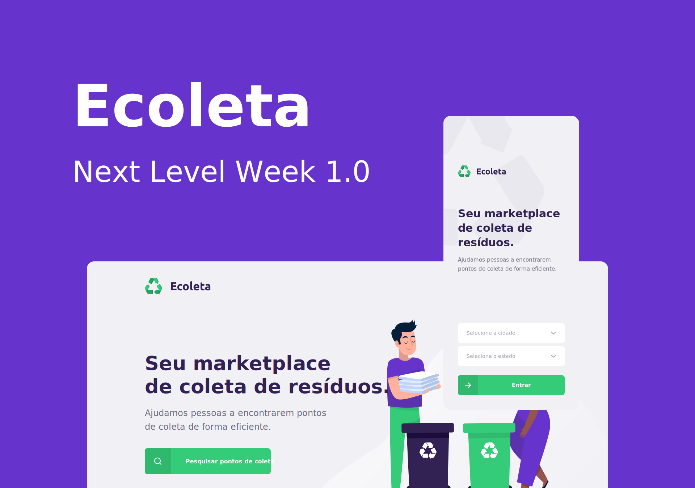

<!-- Cover -->
[](https://nextlevelweek.com)

<!-- Badges -->

[](./LICENSE.md)

## About Ecoleta

Ecoleta is a marketplace platform that helps people find collection points for recyclable materials efficiently. This project was developed for the **International Environment Week** during the [Next Level Week](https://nextlevelweek.com) 1.0 by [@rocketseat](https://github.com/rocketseat). Ecoleta takes the pain out recycling waste by connecting people with collection points, see more:

- Booster [Ecoleta Mobile](https://github.com/guiribmedeiros/ecoleta-mobile).
- Booster [Ecoleta Web](https://github.com/guiribmedeiros/ecoleta-web).
- Starter and Booster designs are available at [Figma](https://www.figma.com/file/RdlEdkUng704Q0OyIHjSGi/Ecoleta).

Ecoleta API is an open-sourced restful api. It is written in [TypeScript](http://www.typescriptlang.org) and
uses [Express](https://expressjs.com/).

## Getting Started

First, let’s make sure that your development environment is ready.

- If you don’t have **Node.js** installed, [install it from here](https://nodejs.org/).

Then configure your development environment from the `.env.example` file and install the dependencies from your project’s `package.json` file by running the following command:

```
npm install
```

Once your dependencies are installed, to run all Knex.js migrations and build your application's database schema, execute the `migrate` command:

```
npm run migrate
```

After building your database your database, you may use the `db:seed` command to seed your database.

```
npm run db:seed
```

Finally, the `serve` script starts your Node.js "development server" on port 8000.

```
npm run serve
```

That’s it! :rocket:  
If you have questions about Ecoleta API, you can ask me on [GitHub Issues](https://github.com/guiribmedeiros/ecoleta-api/issues).
